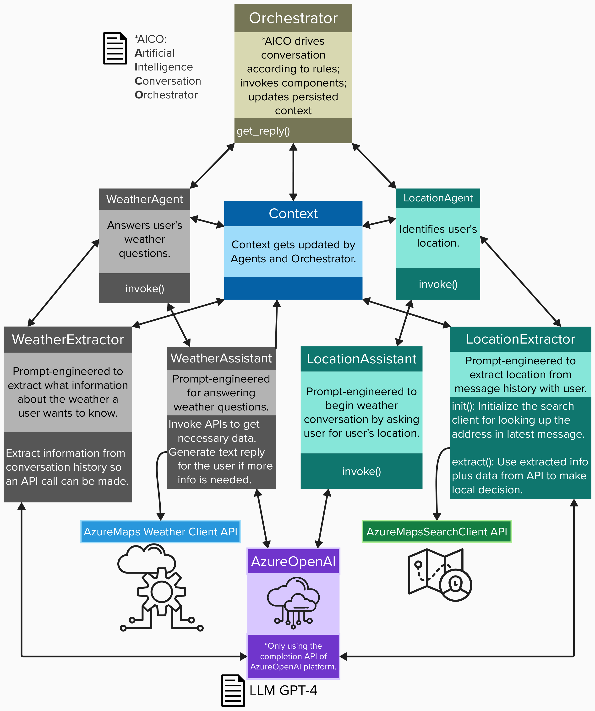

# Design purpose

The main purpose of this app to highlight three unique aspects: the Orchestration system, the Agent pattern (Extract, Decide, Reply), and the Evaluation Techniques. These three things set it apart from other Retrieval Augmented Generation (RAG)+API bots.

- Demonstrate the use of a code-driven **orchestration** of LLMs and APIs for executing a workflow
- Showcase **"Extract, Decide, Reply,"** (EDR) pattern
- Copilot LLM **Evaluation** Techniques 
    - (Synthetic users + End-to-End Eval, and agent-level Eval)

## How this app works

In this Python app's code, there are two agents: **Location** and **Weather**. They communicate with one **Orchestrator**. The agents use external APIs to [ground](https://techcommunity.microsoft.com/t5/fasttrack-for-azure/grounding-llms/ba-p/3843857) the information.

- The **Location** agent talks to the user about their location of interest.
- The **Weather** agent answers the user's questions regarding the weather at that location.
- The **Orchestrator** understands the current state of the conversation from the context, and invokes the appropriate agents to handle the conversation.

On every HTTP request with a message from a user, the Orchestrator receives the message from the user (the string, not to be confused with the HTTP message), as well as the context for the conversation. The context stores the history of the previous messages in this conversation, as well as the knowledge accumulated so far. Having that, the Orchestrator can invoke appropriate agents according to the business rules. 

Each agent solves one specific task. For example: Talk to the user about their location and extract geographical attributes required by internal APIs. 

Each agent can implement the "Extract, Decide, Reply" pattern, which consists of 3 consecutive steps:

- **Extract** step extracts the necessary information from the
conversation state.
- **Decide** step decides what to do next.
- **Reply** step generates a reply for the user, or generates a question if more information is required.

> In some examples, the above is optional. E.g.: if the location agent is able to discern the user's location, it updates the context, and returns control to the orchestrator. The orchestrator then looks at the state, sees that the location is populated or not null, and understands that it can now invoke the weather agent, so it does.

#### While the user interacts with the chatbot, the following things happen:

1. The user's message is sent to the OpenAI GPT-4o model.
2. The chatbot will call the respective Prompt and make another call to the OpenAI GPT-4o model to generate the response. Essentially there will be two calls to the OpenAI GPT-4o model for each user message.
3. The response generated by the OpenAI GPT-4o model is displayed in the chatbot interface or console.
